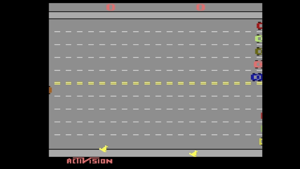
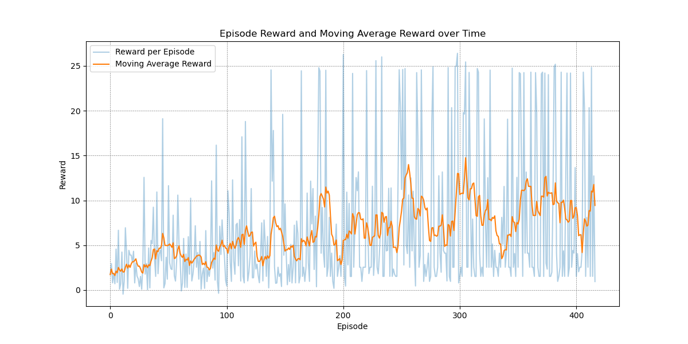

# Implementing RF to play the Atari Freeway game

This project has been implemented with the gymnasium Framework: https://gymnasium.farama.org/environments/atari/freeway/

# Setup Instructions

1. **Clone the Repository**:
    ```bash
    git clone https://github.com/JanMuehlnikel/Atari-Freeway-Reinforcement-Learning
    cd your-repo
    ```

2. **Create and Activate a New Conda Environment**:
    ```bash
    conda create --name FreewayEnv python=3.10.14
    conda activate FreewayEnv
    ```

3. **Install `pip` in the New Conda Environment**:
    ```bash
    conda install pip
    ```

4. **Install Packages from `requirements.txt`**:
    ```bash
    pip install -r requirements.txt
    ```

# Results

Unfortunately, the agent was only capable of learning the baseline method. As seen in the source code, we chose to implement reinforcement learning using a DQN (Deep Q-Network). Our baseline method was simply to move up.

There are several possible reasons for this outcome:

Reward Structure: The agent might have received too much reward for moving or insufficient punishment for crashing, skewing its learning process.
Network Complexity: The network might be too simplistic to approximate the Q-values effectively, limiting its ability to learn more complex behaviors.
Training Resources: The training was conducted on a CPU, which is less efficient than using a GPU for such tasks. Additionally, the training period was limited, which might not have been sufficient for the agent to learn effectively.
These factors likely contributed to the agent's inability to learn beyond the baseline method.

## Succesful Try


## Bad Try


## DQN Learning Curve



